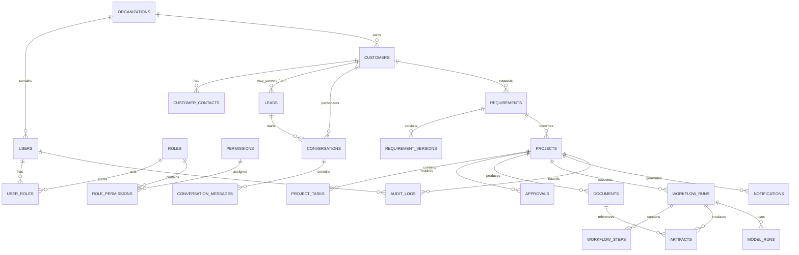

# Database ERD and Core Data Model

## 1. Database strategy

PostgreSQL is the system of record for transactional business data. UUIDs are used as opaque identifiers. All timestamps are stored in UTC.

The database enforces relational integrity, unique constraints, foreign keys, and important state invariants. Application code remains responsible for higher-level workflow rules.

## 2. Logical ERD



## 3. Core entities

### Organizations

Tenant/business boundary for the agency. Even if the first deployment has one organization, keeping this boundary avoids hard-coding a single tenant into the data model.

### Users / roles / permissions

Identity and authorization records. Permissions are assigned through roles rather than scattered boolean flags.

### Customers / contacts

The customer account and its people/contact channels. Customer records are separated from leads because a lead can become a customer while preserving acquisition history.

### Leads

Potential customer records captured from marketing or other permitted channels. A lead stores source, lifecycle state, qualification metadata, and conversion references.

### Conversations / messages

Customer-facing and internal requirement conversations. Messages store author type, channel metadata, timestamps, and normalized content references. Sensitive content should follow retention policy.

### Requirements / requirement versions

A requirement is the stable business object. Versions preserve changes and approval history so the system can answer which requirement set was approved for a project.

### Projects / tasks

A project represents approved work. Tasks provide deterministic execution units for the production workflow.

### Approvals

Explicit authorization records. Approvals are separate entities so a workflow can pause and resume without encoding human decisions into transient worker memory.

### Workflows / workflow steps

Durable execution state and step-level diagnostics. The workflow engine may maintain additional internal state, but the application retains business-relevant references and audit metadata.

### Documents / artifacts

Documents are logical deliverables such as proposals or requirements documents. Artifacts represent concrete generated files/packages/build outputs.

### Notifications

Tracks intended and actual delivery of owner/customer notifications, including status and provider message IDs where applicable.

### Audit logs

Append-oriented record of security-sensitive and business-significant actions.

### Model runs

Records AI execution metadata such as provider, model, capability, token/usage metadata where available, latency, outcome, and correlation references. Prompt/response storage must follow privacy policy and can be stored separately when required.

## 4. Recommended initial columns

Every major entity should include:

```text
id UUID PRIMARY KEY
created_at TIMESTAMPTZ NOT NULL
updated_at TIMESTAMPTZ NOT NULL
```

Business entities may also include `created_by`, `updated_by`, `organization_id`, and a lifecycle/status field as appropriate.

## 5. Important constraints

- Customer contact identifiers must be unique within their relevant organization/channel.
- Requirement version numbers are unique per requirement.
- A project references exactly one approved requirement version before production begins.
- Workflow steps belong to exactly one workflow run.
- Audit records are append-only from the application perspective.
- External provider IDs are indexed and scoped to the integration/provider.
- Idempotency keys are unique for their operation scope.

## 6. Indexing strategy

Initial indexes should cover:

- Organization + lifecycle status.
- Lead source + status + created time.
- Customer email/phone normalized lookup fields where legally appropriate.
- Conversation + message timestamp.
- Requirement + version number.
- Project + status.
- Workflow + status + created time.
- Workflow step + workflow + status.
- Audit + entity + timestamp.
- Notification + status + next attempt time.

Indexes should be added based on measured query patterns rather than indiscriminately indexing every field.

## 7. Data classification

| Data | Classification | Default handling |
|---|---|---|
| Public marketing content | Public/Business | Normal application controls |
| Lead contact information | Confidential | Access controlled, retention policy |
| Customer requirements | Confidential | Access controlled, audit access |
| Generated source code | Confidential | Isolated storage/workspaces |
| API credentials | Secret | Secret manager/environment only |
| Model prompts/responses | Potentially confidential | Minimize, redact, retain by policy |
| Audit logs | Restricted | Append-oriented, access controlled |

## 8. Migration rules

- Migrations are forward-only in shared environments.
- Every schema change has a migration file.
- Destructive changes require explicit review and a rollback/data-recovery plan.
- Production migrations should be backward-compatible when rolling deployments are used.
- Seeds contain only non-secret deterministic development data.

## 9. Future extensions

Potential later additions include:

- Social accounts and publishing jobs.
- Campaigns and content assets.
- Knowledge documents and embeddings.
- Usage/cost ledgers.
- Evaluation datasets and AI quality scores.
- Deployment environments and releases.
- Webhook deliveries.

These should be introduced when their workflows are implemented rather than pre-building unused complexity.
